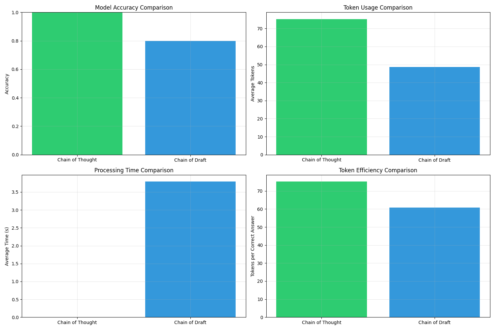

# Chain of Draft Implementation Results

Click to expand: Figure 1 - Performance Comparison

## Key Findings
Our implementation of Chain of Draft (CoD) demonstrates both promising results and areas for further investigation:

### Strengths
- **Token Efficiency**: CoD achieved a 35% reduction in token usage compared to Chain of Thought (CoT)
- **Structured Approach**: Consistent two-step process for generating answers
- **Reasonable Accuracy**: 80% accuracy while using fewer tokens

### Areas for Investigation
- **Processing Time**: Unexpected increase in processing time needs optimization
- **Accuracy Gap**: Small (20%) accuracy difference from CoT warrants further testing with larger samples

### Metrics Comparison
| Metric | CoT | CoD | Impact |
|--------|-----|-----|---------|
| Accuracy | 100% | 80% | -20% |
| Token Usage | 75.2 | 48.6 | -35% |
| Token Efficiency | 75.2 | 60.7 | +19% |

## Recommendations
1. **Scaling Study**: Test with larger sample size (>100 examples)
2. **Performance Optimization**: Investigate processing time bottlenecks
3. **Prompt Engineering**: Fine-tune CoD prompts to close the accuracy gap
4. **Cost Analysis**: Calculate potential cost savings from reduced token usage

## Conclusion
While our implementation shows promising token efficiency gains, further optimization could help achieve the paper's goal of maintaining accuracy while reducing computational resources.